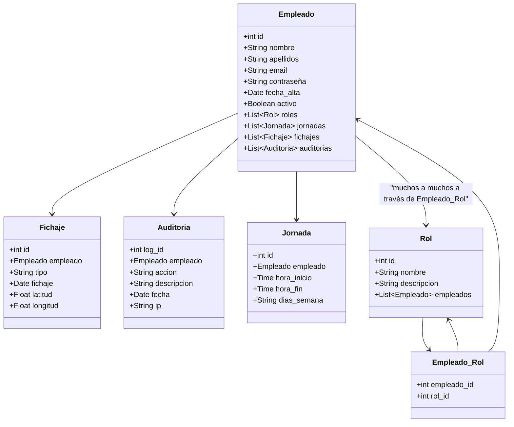
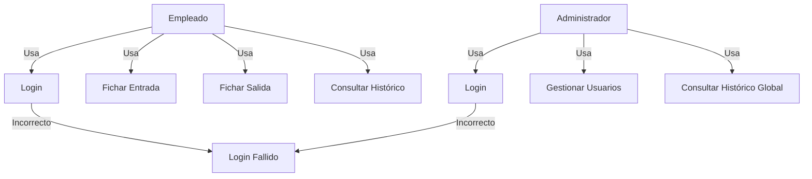
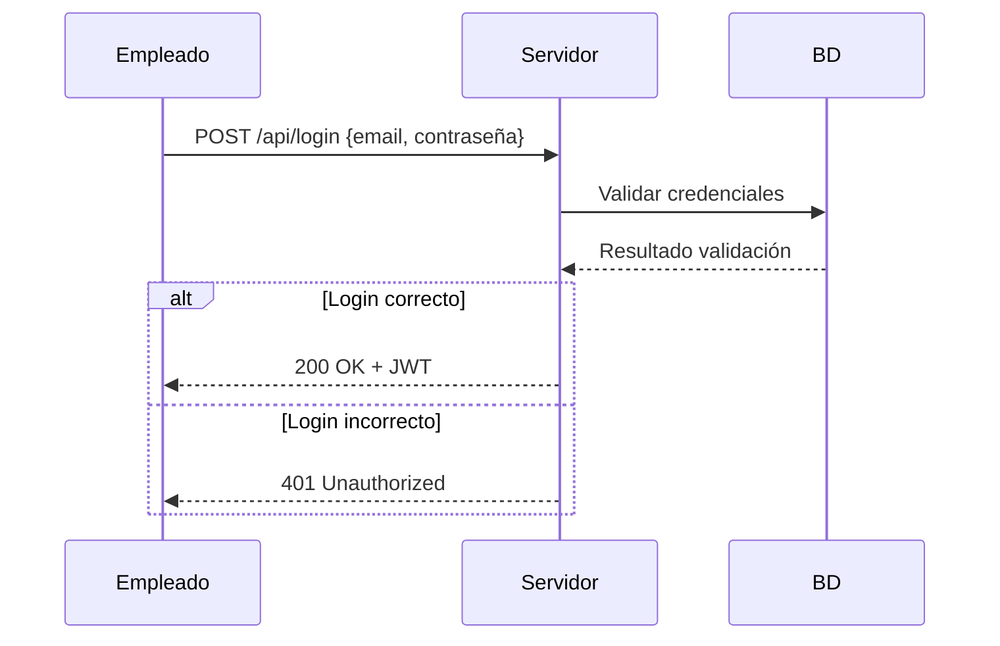
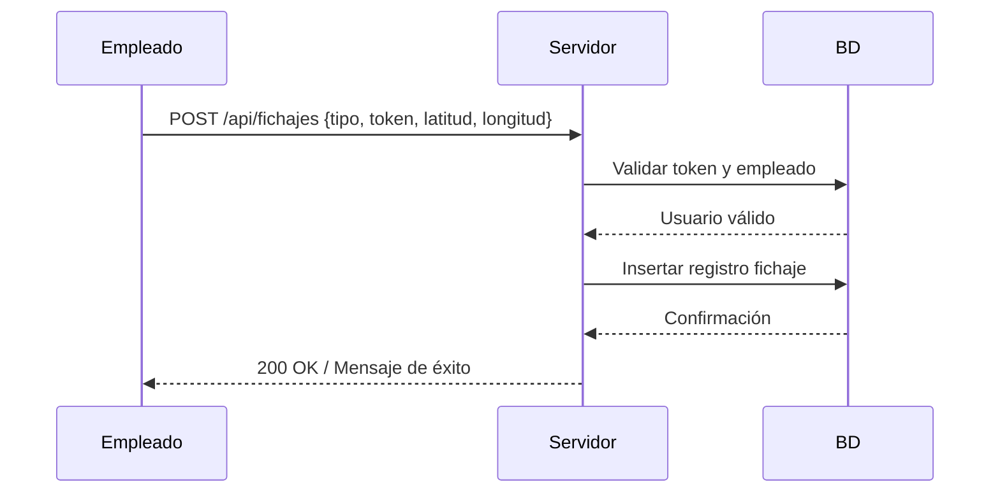
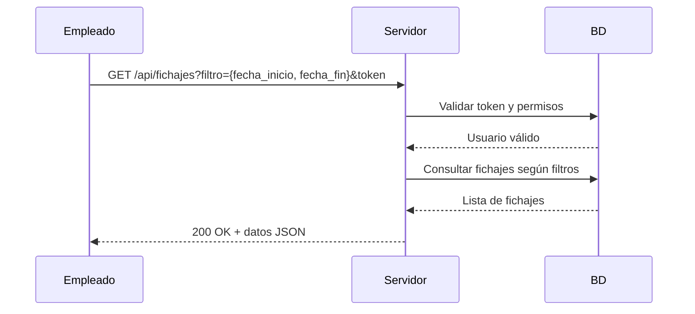

# Work O’Clock - Proyecto

## 1. Estudio del problema y análisis del sistema

### 1.1 Introducción
Work O’Clock es una solución para registrar la jornada laboral de los empleados mediante una **interfaz web React**, un **servidor Java con Spring Boot y APIs REST** y una **base de datos MySQL**.

### 1.2 Finalidad
- Registrar entrada y salida de empleados.  
- Consultar histórico de fichajes.  
- Gestionar usuarios y roles desde la interfaz administrativa.

### 1.3 Objetivos
- Personales: mejorar habilidades frontend y backend.  
- Profesionales: crear un sistema seguro, escalable y mantenible.
- Software: fichaje, consultas, gestión de usuarios, seguridad, integridad y rendimiento.

## 2. Análisis de Requisitos

### 2.1 Requisitos funcionales
- RF1: Login/logout con JWT.  
- RF2: Fichaje de entrada/salida.  
- RF3: Consulta de histórico.  
- RF4: Gestión de usuarios por administrador.  
- RF5: Roles y permisos diferenciados.

### 2.2 Requisitos no funcionales
- Seguridad (HTTPS, JWT, hashed passwords).  
- Rendimiento y escalabilidad.  
- Interfaz web responsiva y accesible.  
- Mantenibilidad y modularidad.

## 3. Planificación
| Fase | Duración |
|------|----------|
| Análisis y diseño | 2 semanas |
| Base de datos + servidor | 3 semanas |
| Desarrollo React | 4 semanas |
| Integración y pruebas | 2 semanas |
| Documentación y despliegue | 1 semana |

## 4. Diseño

### 4.1 Interfaz React
- `LoginPage`, `FichajePage`, `HistoricoPage`, `AdminPage`, `NavBar`, `ProtectedRoute`  
- Diseño responsivo, Material-UI/Tailwind.

### 4.2 Base de Datos
- **Usuarios**: id, nombre, apelidos, email, contraseña(hasheada), fecha alta, activo  
- **Roles**: Id, nombre, descripción
- **Empleados_Roles**: Empleado_id, rol_id
- **Jornada**: id, empleado_id, hora_inicio, hora_fin, días_semana
- **Fichajes**: id, empleado_id, tipo, fichaje, latitud, longitud  
- **Auditoría**: log_id, empleado_id, acción, fecha_hora

### 4.3 Diagrama de Clases

### 4.4 Casos de Uso



### 4.5 Diagrama de Secuencia: Fichaje
#### 4.5.1 Login

#### 4.5.2 Fichaje entrada/salida

#### 4.5.3 Consultar histórico



### 4.6 Diagrama de Estados: Fichaje
#### 4.6.1 Empleado
```mermaid
stateDiagram-v2
    [*] --> DesconectadoEmpleado

    %% Login
    DesconectadoEmpleado --> AutenticadoEmpleado : login correcto
    DesconectadoEmpleado --> [*] : login incorrecto

    %% Estados de fichaje
    AutenticadoEmpleado --> EsperandoFichaje
    EsperandoFichaje --> FichadoEntrada : fichar entrada
    FichadoEntrada --> EsperandoFichaje : registro correcto
    EsperandoFichaje --> FichadoSalida : fichar salida
    FichadoSalida --> EsperandoFichaje : registro correcto

    %% Consultas
    EsperandoFichaje --> ConsultandoHistorico : consultar histórico
    ConsultandoHistorico --> EsperandoFichaje : finalizar consulta

    %% Errores
    AutenticadoEmpleado --> ErrorEmpleado : fallo servidor o token inválido
    FichadoEntrada --> ErrorEmpleado : fallo al registrar fichaje
    FichadoSalida --> ErrorEmpleado : fallo al registrar fichaje
    ConsultandoHistorico --> ErrorEmpleado : fallo al consultar datos
  ```
  #### 4.6.2 Admin
```mermaid
stateDiagram-v2
    [*] --> DesconectadoAdmin

    %% Login
    DesconectadoAdmin --> AutenticadoAdmin : login correcto
    DesconectadoAdmin --> [*] : login incorrecto

    %% Panel administración
    AutenticadoAdmin --> AdminPanel : acceso a panel admin
    AdminPanel --> GestionUsuarios : gestionar usuarios
    GestionUsuarios --> AdminPanel : volver al panel admin
    AdminPanel --> ConsultarHistoricoGlobal : consultar histórico global
    ConsultarHistoricoGlobal --> AdminPanel : finalizar consulta

    %% Errores
    AutenticadoAdmin --> ErrorAdmin : fallo servidor o token inválido
    ConsultarHistoricoGlobal --> ErrorAdmin : fallo al consultar datos
 ```

## 5. Desarrollo

### 5.1 Interfaz React
*(En construcción)*
- Componentes: `LoginPage`, `FichajePage`, `HistoricoPage`, `AdminPage`, `NavBar`, `ProtectedRoute`.  
- Axios para consumo de APIs, React Router para navegación, Context/Redux para estado global.  
- Diseño responsivo, feedback de usuario con loaders y alertas.

### 5.2 Servidor (Java / Spring Boot)
*(En construcción)*
#### 5.2.1 Arquitectura básica
```mermaid
graph LR
    Front <--> |DTO| Controlador
    Controlador <--> Servicio
    Servicio <--> Repositorio
    Repositorio <--> Modelo
```
- **DTO**: Objetos que intercambias con el front. Evita exponer directamente las entidades del modelo y permite: Validaciones, transformaciones y evita que el front vea campos sensibles.
- **Controlador**: Exposición de los endpoints REST que el front va a consumir. Maneja las utilidades HTTP (Get, Post, Put, Del), llama al servicio para ejecutar la lógica y devuelve DTOs al front.
- **Servicio**: Lógica de negocio. Sirve para mantener el control sobre operaciones complejas, reutilizar el código y separar la lógica del controlador, que solo recibe y devuelve datos.
- **Repositorio**: Interfaz que se comunica directamente con la base de datos usando Hibernate/JPA. Encapsula operaciones CRUD y evita escribir SQL a mano. Spring Boot ya implementa estos métodos CRUD.  
- **Modelo**: Clases Java que representan las tablas de la base de datos. Cada atributo de la clase corresponde a una columna. Hibernate (o JPA) convierte estas clases en registros de la base de datos y maneja la persistencia automáticamente.
#### 5.2.2 Endpoints REST
##### 5.2.2.1 Empleados
- **GET** `/empleados` : Listar todos los empleados  
- **GET** `/empleados/{id}` : Obtener un empleado por ID  
- **POST** `/empleados` : Crear un nuevo empleado  
- **PUT** `/empleados/{id}` : Actualizar datos de un empleado  
- **DELETE** `/empleados/{id}` : Desactivar o eliminar un empleado  

##### 5.2.2.2 Empleados Roles
- **GET** `/empleados/{id}/roles` : Listar roles de un empleado  
- **POST** `/empleados/{id}/roles` : Asignar uno o varios roles a un empleado  
- **DELETE** `/empleados/{id}/roles/{rol_id}` : Quitar un rol a un empleado  

##### 5.2.2.3 Roles
- **GET** `/roles` : Listar todos los roles  
- **GET** `/roles/{id}` : Obtener un rol por ID  
- **POST** `/roles` : Crear un nuevo rol  
- **PUT** `/roles/{id}` : Actualizar un rol  
- **DELETE** `/roles/{id}` : Eliminar un rol  

##### 5.2.2.4 Jornadas
- **GET** `/jornadas` : Listar todas las jornadas  
- **GET** `/jornadas/{id}` : Obtener jornada por ID  
- **GET** `/empleados/{id}/jornadas` : Obtener jornadas de un empleado  
- **POST** `/jornadas` : Crear una nueva jornada  
- **PUT** `/jornadas/{id}` : Actualizar jornada  
- **DELETE** `/jornadas/{id}` : Eliminar jornada  

##### 5.2.2.5 Fichajes
- **GET** `/fichajes` : Listar todos los fichajes  
- **GET** `/fichajes/{id}` : Obtener un fichaje por ID  
- **GET** `/empleados/{id}/fichajes` : Listar fichajes de un empleado  
- **GET** `/empleados/{id}/fichajes/ultimo` : Obtener último fichaje de un empleado  
- **POST** `/fichajes` : Registrar un fichaje (entrada/salida)  

##### 5.2.2.6 Auditorías
- **GET** `/auditorias` : Listar todas las auditorías  
- **GET** `/auditorias/{id}` : Obtener una auditoría por ID  
- **GET** `/empleados/{id}/auditorias` : Listar auditorías de un empleado  
- **POST** `/auditorias` : Registrar una acción de auditoría

#### 5.2.3 Autenticación y JWT
 *(En construcción)*

### 5.3 Base de Datos
*(En construcción)*
- Base de datos MySQL: tablas **Usuarios**, **Roles**, **Fichajes**, **Auditoría**.  
- Índices: `usuario_id` y `fecha_hora` para consultas rápidas.

## 6. Pruebas
- Unitarias: server (JUnit + Mockito), frontend (Jest + React Testing Library).  
- Integración: endpoints y consumo desde React.  
- UI: flujo fichaje, histórico y rutas protegidas.  
- Seguridad: autenticación, autorización y tokens.  
- Carga (opcional): simulación de múltiples usuarios concurrentes.

## 7. Recursos de Software
- Servidor: Java 17, Spring Boot 3, Spring Data JPA, Spring Security, JWT, Hibernate, JSON.  
- Frontend: React 18+, Axios, Redux/Context, React Router, Material-UI/Tailwind.  
- Base de datos: MySQL 8.
- Testing: JUnit, Mockito, Jest, React Testing Library.  
- Documentación: Swagger/OpenAPI.  
- Control de versiones: Git.

## 8. Seguimiento
- Git con ramas `main`, `develop`, `feature/...`.  
- Trello o Jira para gestión de tareas.  
- Integración continua opcional (GitHub Actions, CI/CD).

## 9. Implantación
- Servidor con SSL y base de datos configurada.  
- Frontend desplegado en hosting (Netlify, Vercel o AWS).  
- Configuración de variables de entorno (URLs, JWT secret).  
- Backup automático de base de datos y monitorización de logs.  
- Plan de pruebas de aceptación antes del despliegue final.

## 10. Conclusión
Work O’Clock es un sistema escalable y seguro que integra **React**, **Java/Spring Boot** y **MySQL**, permitiendo a empleados y administradores gestionar la jornada laboral de manera eficiente.  
El proyecto sigue buenas prácticas de arquitectura, seguridad, pruebas y documentación, garantizando su viabilidad y mantenimiento a largo plazo.

