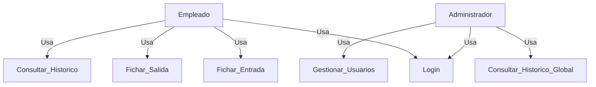
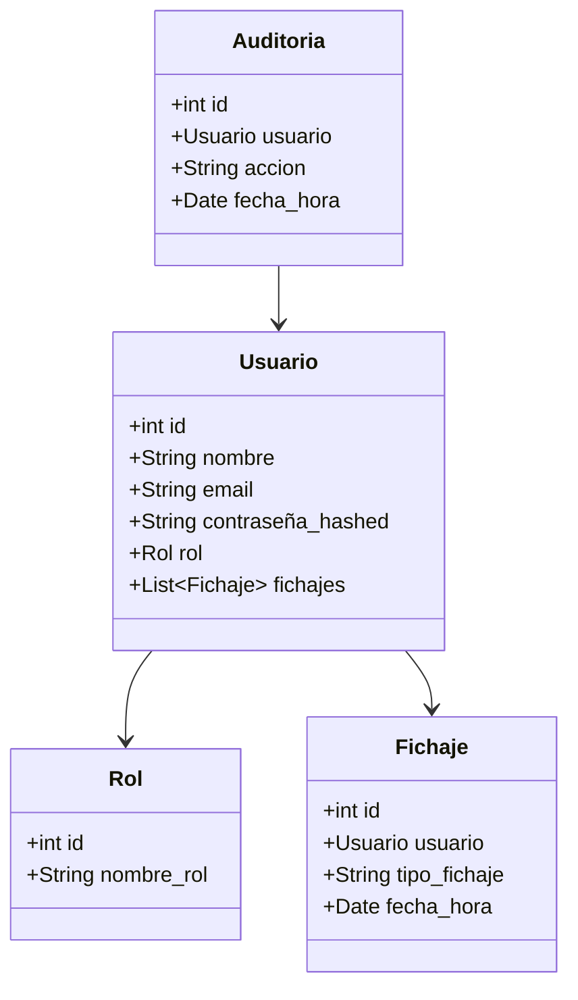
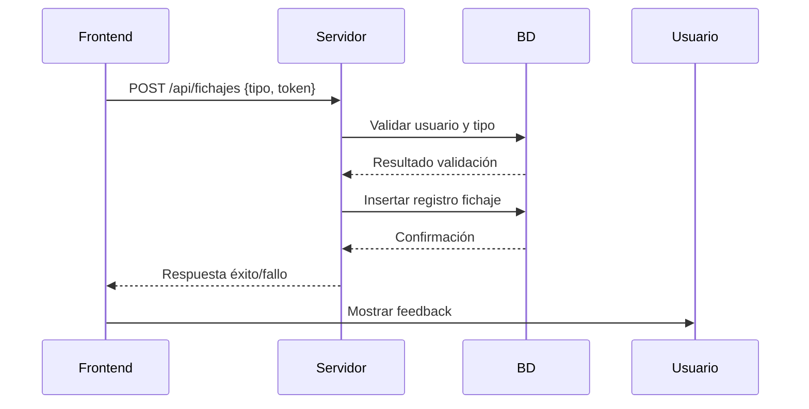
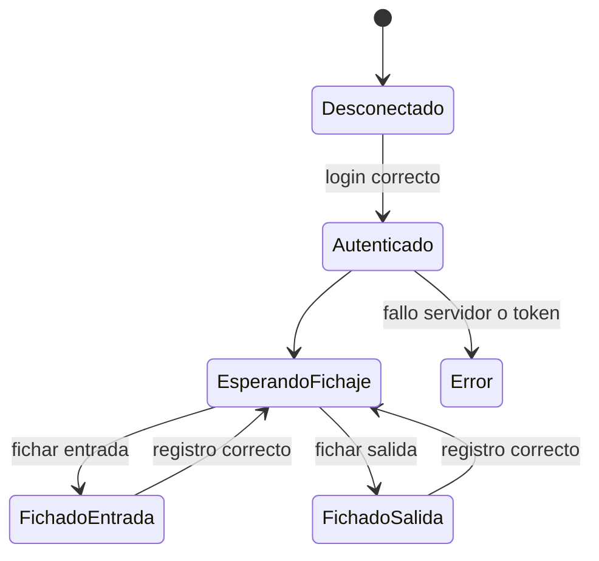

# Work O’Clock - Proyecto

## 1. Estudio del problema y análisis del sistema

### 1.1 Introducción
Work O’Clock es una solución para registrar la jornada laboral de los empleados mediante una **interfaz web React**, un **servidor Java con APIs REST** y una **base de datos MySQL**.

### 1.2 Finalidad
- Registrar entrada y salida de empleados.  
- Consultar histórico de fichajes.  
- Gestionar usuarios y roles desde la interfaz administrativa.

### 1.3 Objetivos
- Personales: mejorar habilidades frontend y backend.  
- Profesionales: crear un sistema seguro, escalable y mantenible.
- Software: fichaje, consultas, gestión de usuarios, seguridad, integridad y rendimiento.

## 2. Análisis de Requisitos

### 2.1 Requisitos funcionales
- RF1: Login/logout con JWT.  
- RF2: Fichaje de entrada/salida.  
- RF3: Consulta de histórico.  
- RF4: Gestión de usuarios por administrador.  
- RF5: Roles y permisos diferenciados.

### 2.2 Requisitos no funcionales
- Seguridad (HTTPS, JWT, hashed passwords).  
- Rendimiento y escalabilidad.  
- Interfaz web responsiva y accesible.  
- Mantenibilidad y modularidad.

## 3. Planificación
| Fase | Duración |
|------|----------|
| Análisis y diseño | 2 semanas |
| Base de datos + servidor | 3 semanas |
| Desarrollo React | 4 semanas |
| Integración y pruebas | 2 semanas |
| Documentación y despliegue | 1 semana |

## 4. Diseño

### 4.1 Interfaz React
- `LoginPage`, `FichajePage`, `HistoricoPage`, `AdminPage`, `NavBar`, `ProtectedRoute`  
- Diseño responsivo, Material-UI/Tailwind.

### 4.2 Base de Datos
- **Usuarios**: id, nombre, email, contraseña_hashed, rol_id  
- **Roles**: rol_id, nombre_rol, permisos  
- **Fichajes**: fichaje_id, usuario_id, tipo_fichaje, fecha_hora  
- **Auditoría**: log_id, usuario_id, acción, fecha_hora

### 4.3 Casos de Uso

### 4.4 Diagrama de Clases

### 4.5 Diagrama de Secuencia: Fichaje

### 4.6 Diagrama de Estados: Fichaje

## 5. Desarrollo

### 5.1 Base de Datos
- Base de datos MySQL: tablas **Usuarios**, **Roles**, **Fichajes**, **Auditoría**.  
- Índices: `usuario_id` y `fecha_hora` para consultas rápidas.

### 5.2 Servidor (Java / Spring Boot)
- Endpoints REST, seguridad, servicios de negocio y repositorios.
- Diagramas: secuencia y clases incluidos.

### 5.3 Interfaz React
- Componentes: `LoginPage`, `FichajePage`, `HistoricoPage`, `AdminPage`, `NavBar`, `ProtectedRoute`.  
- Axios para consumo de APIs, React Router para navegación, Context/Redux para estado global.  
- Diseño responsivo, feedback de usuario con loaders y alertas.

## 6. Pruebas
- Unitarias: server (JUnit + Mockito), frontend (Jest + React Testing Library).  
- Integración: endpoints y consumo desde React.  
- UI: flujo fichaje, histórico y rutas protegidas.  
- Seguridad: autenticación, autorización y tokens.  
- Carga (opcional): simulación de múltiples usuarios concurrentes.

## 7. Recursos de Software
- server: Java 17, Spring Boot 3, Spring Data JPA, JWT.  
- Frontend: React 18+, Axios, Redux/Context, React Router, Material-UI/Tailwind.  
- Base de datos: MySQL 8.  
- Testing: JUnit, Mockito, Jest, React Testing Library.  
- Documentación: Swagger/OpenAPI.  
- Control de versiones: Git.

## 8. Seguimiento
- Git con ramas `main`, `develop`, `feature/...`.  
- Trello o Jira para gestión de tareas.  
- Integración continua opcional (GitHub Actions, CI/CD).

## 9. Implantación
- Servidor con SSL y base de datos configurada.  
- Frontend desplegado en hosting (Netlify, Vercel o AWS).  
- Configuración de variables de entorno (URLs, JWT secret).  
- Backup automático de base de datos y monitorización de logs.  
- Plan de pruebas de aceptación antes del despliegue final.

## 10. Conclusión
Work O’Clock es un sistema escalable y seguro que integra **React**, **Java/Spring Boot** y **MySQL**, permitiendo a empleados y administradores gestionar la jornada laboral de manera eficiente.  
El proyecto sigue buenas prácticas de arquitectura, seguridad, pruebas y documentación, garantizando su viabilidad y mantenimiento a largo plazo.

